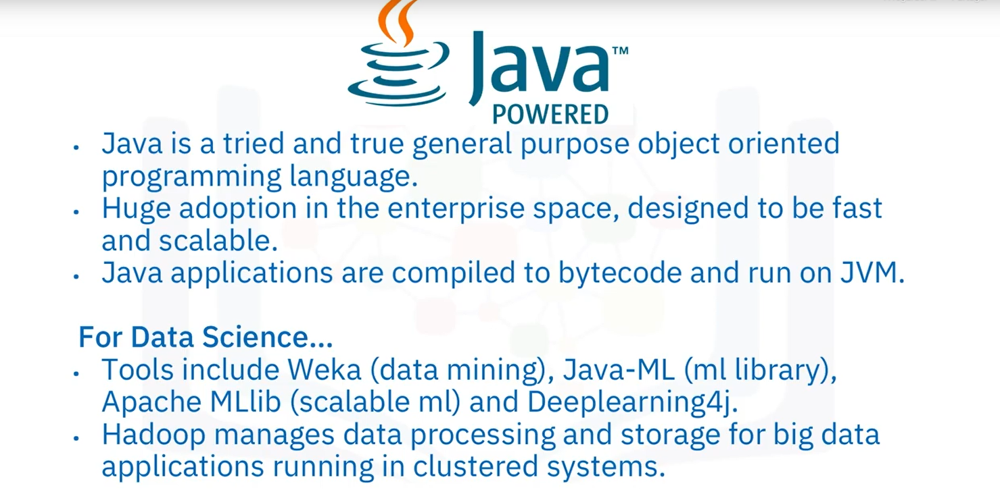
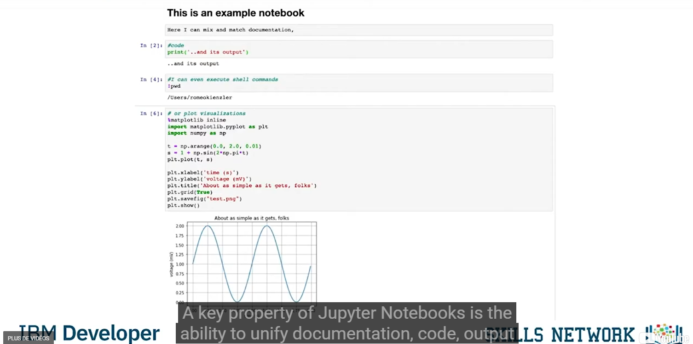

# Data Science Tools
In this course you’ll receive one of the most comprehensive overviews on open source and commercial tooling available for data science, and the skills on how to use them.

## Introduction to Tools for Data Science
### Key Points

### Data is central to data science

### Data science requires Programming

### Automation with Data Science Tooling

### Visual Programming & Modeling

### Open Source & Commercial Tools

### Data Science on Cloud

### Overview

## Course Overview
What are some of the most popular data science tools, how do you use them, and what are their features?

In this course, you'll learn about the day-to-day experiences of Data Scientists. You’ll be introduced to some of the programming languages commonly used, including Python, R, Scala, and SQL. You’ll work with the tools that professional Data Scientists work with, like Jupyter Notebooks, RStudio IDE, and others. You will learn about what each tool is used for, what languages they can execute, and their features and limitations. With the tools hosted in the cloud on Cognitive Class Labs, you will be able to use each tool and follow instructions to run simple code in Python, R, or Scala.
## Prerequisite
We have created this course so that anyone with basic computer skills would be able to learn about the tools for data science. The only prerequisite for this course is your desire to learn.
## Changelog
* 08 Oct 2020 (Aije Egwaikhide): Re-ordered course and dividd modules into 7 parts

* 01 Sept 2020: Updated version of the course published on edX.org.

* 01 Sept 2020 (Sonia Gupta): Replaced links to labs with links from SN Asset Library.

* 23 Mar 2020: Initial version of the course published on edX.org.

## Syllabus
* Module 0 - Welcome and Course Introduction
* Module 1 - Languages of Data Science
* Module 2 - Data Science Tools
* Module 3 - Packages, APIs, Data Sets and Models
* Module 4 - GitHub
* Module 5 - Jupyter Notebooks and JupyterLab
* Module 6 - RStudio IDE
* Module 7 - Watson Studio
## Module 1 - Language of Data Science
### Languages of Data Science
### Which language should I learn ?

### So many languages recommended in Data Science!

### So many popular languages!

### Roles in Data Science

### Lesson 1: Outline

### Introduction to Python
#### Diversity and Inclusion Efforts

#### Who is Python for ?

#### What makes Python great:

### Introduction to R Language
#### Open Source Vs. Free Software

#### Back to the joys of R...

#### Who is R for ?

#### What makes R great:

#### Global Communicaties

### Introduction to SQL
#### What is SQL ?

#### Relational Databases

#### SQL Elements

#### What makes SQL great:

#### Many SQL Databases Available

### Other Languages

#### Java

#### Scala

#### C++

#### JS

#### Julia

## Module 2 - Data Science Tools
### Categories of Data Science Tools
#### Data Management

#### Data Integration and Transformation

#### Data Visualization

#### Data Modeling

#### Model Deployement

#### Model Monitoring and Assessement

#### Code Asset Management

#### Data Asset Management

#### Development Environments

#### Execution Environments

#### Fully Integrated Visual Tools

### Open Source Tools for Data Science - Part 1
#### Data Management Tools

#### Data Integration and Transformation Tools

#### Data Visualization Tools

#### Model Deployement Tools

#### Model Monitoring and Assessement Tools

#### Code Asset Management Tools

#### Data Asset Management( or Data Government) Tools

### Open Source Tools for Data Science - Part 2
#### Development Environment Tools

##### Jupyter Tools

##### JupyterLab Tools

#### Apache Zepplin Notebook Tools

#### RStudio Tools

#### Spider Tools

#### Apache Spark

#### Apache Flink

* Flink is a stream processing
* Flink is image processing, with its mains focus on processus
#### Ray

* it focus large-scale deep learning model training
### Tools with no programming level necessary

#### KNIME

#### Orange

### Commercial Tools for Data Science
#### Data Management Tools

#### Data Integration and Transformation Tools

#### Data Virtualization Tools

#### Model Building Tools

#### Model Deployement

#### Data Asset Tools

#### Fully Integrated Visual Tools

##### Watson Studio Tools and watson Open Scale

* it combine jupyter notebook with graphical tools to mixamize data scientist performance
* integrated and cover fully in the data science live cycle and all the tache we discuss previously
#### Other Data Science Tools commercial
##### H2O.ai

### Cloud Based Tools for Data Science

This clusters are composed of multiple server machines transparently for the user in the background.
### Watson Studio, together with Watson OpenScale

Watson Studio, together with Watson OpenScale, covers the complete development lefe cycle all data science machine learning ad IA tasks
### Azure Machine Learning

cloudhosted offering supporting the complete
development life cycle of all data science, machine learning and IA tasks.
### H2O.ai

### Data Management

#### Amazon DynamoDB 

it is Amazon Web services DynamoDB, a noSQL database that akkows storage and retrieval of data in key value or document store format.
#### Cloudant 

it is a database as a service offering
#### CouchDB 

it is apache couch DB, it has a adventage although complex operational tasks like updating backup restore and scaling are done by the cloud privider under the hood. This offering is compatible with couch DB, therefore the application can be migrated to another couch DB server without changing the application.
#### IBM DB 2 as a service as well.

### Data Integration and Transformation

When it comes to commercial data integration tools, we talk not only about "Extract, Transform, and Load", or "ETL" tools, but also about "Extract, Load, and Transform", or "ELT" tools.
#### IBM Data Refinery

Data Refinery enables transformation of large amounts of raw data into consumable quality information in a spread sheet-like user interface.
