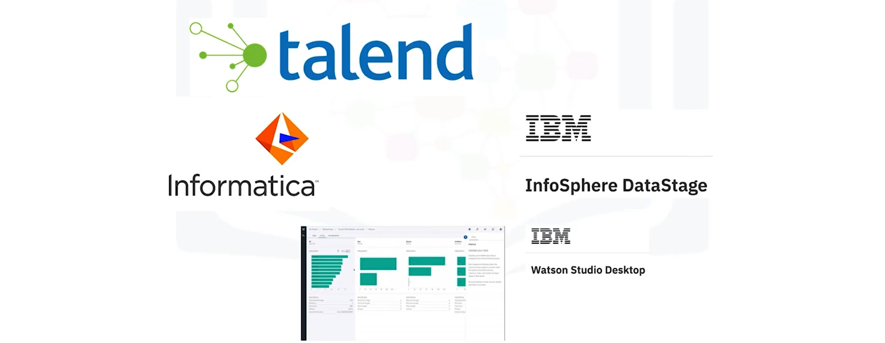
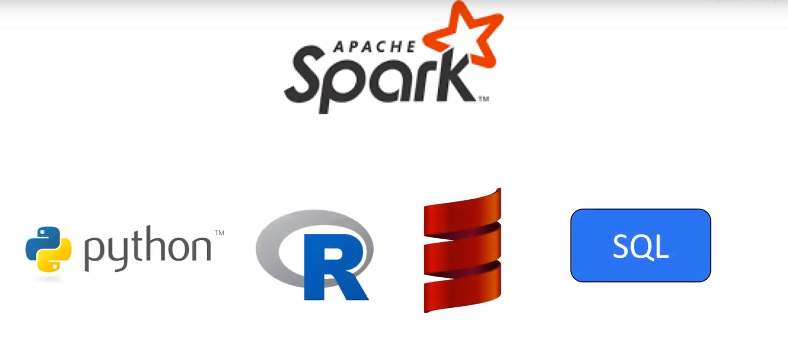
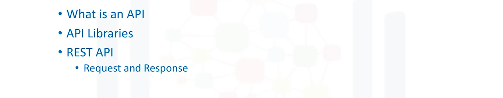

# Data Science Tools
In this course you’ll receive one of the most comprehensive overviews on open source and commercial tooling available for data science, and the skills on how to use them.

## Introduction to Tools for Data Science
### Key Points

### Data is central to data science

### Data science requires Programming

### Automation with Data Science Tooling

### Visual Programming & Modeling

### Open Source & Commercial Tools

### Data Science on Cloud

### Overview

## Course Overview
What are some of the most popular data science tools, how do you use them, and what are their features?

In this course, you'll learn about the day-to-day experiences of Data Scientists. You’ll be introduced to some of the programming languages commonly used, including Python, R, Scala, and SQL. You’ll work with the tools that professional Data Scientists work with, like Jupyter Notebooks, RStudio IDE, and others. You will learn about what each tool is used for, what languages they can execute, and their features and limitations. With the tools hosted in the cloud on Cognitive Class Labs, you will be able to use each tool and follow instructions to run simple code in Python, R, or Scala.
## Prerequisite
We have created this course so that anyone with basic computer skills would be able to learn about the tools for data science. The only prerequisite for this course is your desire to learn.
## Changelog
* 08 Oct 2020 (Aije Egwaikhide): Re-ordered course and dividd modules into 7 parts

* 01 Sept 2020: Updated version of the course published on edX.org.

* 01 Sept 2020 (Sonia Gupta): Replaced links to labs with links from SN Asset Library.

* 23 Mar 2020: Initial version of the course published on edX.org.

## Syllabus
* Module 0 - Welcome and Course Introduction
* Module 1 - Languages of Data Science
* Module 2 - Data Science Tools
* Module 3 - Packages, APIs, Data Sets and Models
* Module 4 - GitHub
* Module 5 - Jupyter Notebooks and JupyterLab
* Module 6 - RStudio IDE
* Module 7 - Watson Studio
## Module 1 - Language of Data Science
### Languages of Data Science
### Which language should I learn ?

### So many languages recommended in Data Science!

### So many popular languages!

### Roles in Data Science

### Lesson 1: Outline

### Introduction to Python
#### Diversity and Inclusion Efforts

#### Who is Python for ?

#### What makes Python great:

### Introduction to R Language
#### Open Source Vs. Free Software

#### Back to the joys of R...

#### Who is R for ?

#### What makes R great:

#### Global Communicaties

### Introduction to SQL
#### What is SQL ?

#### Relational Databases

#### SQL Elements

#### What makes SQL great:

#### Many SQL Databases Available

### Other Languages

#### Java

#### Scala

#### C++

#### JS

#### Julia

## Module 2 - Data Science Tools
### Categories of Data Science Tools
#### Data Management

#### Data Integration and Transformation

#### Data Visualization

#### Data Modeling

#### Model Deployement

#### Model Monitoring and Assessement

#### Code Asset Management

#### Data Asset Management

#### Development Environments

#### Execution Environments

#### Fully Integrated Visual Tools

### Open Source Tools for Data Science - Part 1
#### Data Management Tools

#### Data Integration and Transformation Tools

#### Data Visualization Tools

#### Model Deployement Tools

#### Model Monitoring and Assessement Tools

#### Code Asset Management Tools

#### Data Asset Management( or Data Government) Tools

### Open Source Tools for Data Science - Part 2
#### Development Environment Tools

##### Jupyter Tools

##### JupyterLab Tools

#### Apache Zepplin Notebook Tools

#### RStudio Tools

#### Spider Tools

#### Apache Spark

#### Apache Flink

* Flink is a stream processing
* Flink is image processing, with its mains focus on processus
#### Ray

* it focus large-scale deep learning model training
### Tools with no programming level necessary

#### KNIME

#### Orange

### Commercial Tools for Data Science
#### Data Management Tools

#### Data Integration and Transformation Tools

#### Data Virtualization Tools

#### Model Building Tools

#### Model Deployement

#### Data Asset Tools

#### Fully Integrated Visual Tools

##### Watson Studio Tools and watson Open Scale

* it combine jupyter notebook with graphical tools to mixamize data scientist performance
* integrated and cover fully in the data science live cycle and all the tache we discuss previously
#### Other Data Science Tools commercial
##### H2O.ai

### Cloud Based Tools for Data Science

This clusters are composed of multiple server machines transparently for the user in the background.
### Watson Studio, together with Watson OpenScale

Watson Studio, together with Watson OpenScale, covers the complete development lefe cycle all data science machine learning ad IA tasks
### Azure Machine Learning

cloudhosted offering supporting the complete
development life cycle of all data science, machine learning and IA tasks.
### H2O.ai

### Data Management

#### Amazon DynamoDB 

it is Amazon Web services DynamoDB, a noSQL database that akkows storage and retrieval of data in key value or document store format.
#### Cloudant 

it is a database as a service offering
#### CouchDB 

it is apache couch DB, it has a adventage although complex operational tasks like updating backup restore and scaling are done by the cloud privider under the hood. This offering is compatible with couch DB, therefore the application can be migrated to another couch DB server without changing the application.
#### IBM DB 2 as a service as well.

### Data Integration and Transformation

When it comes to commercial data integration tools, we talk not only about "Extract, Transform, and Load", or "ETL" tools, but also about "Extract, Load, and Transform", or "ELT" tools.
#### IBM Data Refinery

Data Refinery enables transformation of large amounts of raw data into consumable quality information in a spread sheet-like user interface.
### Data Visualization

#### Watson Studio

In watson Studio, an abundance of different visualizations can be used to better understand data
### Model building

### Model deployement

### Model Monitoring and Assessement

### Module 3
### Libraries for Data Science

#### Outline

#### Scientifics Computing Libraries in Python 

* The primary instrument of Pandas is a two-dimensional table consisting of columns and rows. This table is caled a "DataFrame" and designed to provide easy indexing so you can work with your data.
* Numpy libraries are based on arrays, enabling you to apply mathematical functions to these, pandas is actually build on top of Numpy.
### Visualization Libraries
Data Visualization methods are a great way to communicate with others and show the meaningfull results of analysis. These libraries enable you to create graphs, charts and maps.

* Matplotlib(plots & most popular) the Matplotlib package is the most well-know library data visualization, and it's excellent for making graphs and plots.
* seaborn is based on matplotlib. Seaborn makes it easy to generate plots like heat maps, time series, and violon plots.
* ### Machine Learning and Deep Learning Libraries In Python

* For machine learning, the Scikit-learn library contains tools for statistical modeling, including regression, classification, clustering and others. It is built on Numpy, Scipy and Matplotlib and it's relatively simple to get started.
* For Deep Learning, Keras enable you to build the standard deep learning model. Like Scikit-learning, the high-level interface enables you to build models quickly and simply. It can function using graphics processing units(GPU), but for many deep learning cases a lowel-level environment is required.

### Deep Learning Libraries in Python

* TensorFlow is a low-level framework used in large production of deep learning models. It designed for production but can be unwieldy for experimentation.
* PyTorch is used for experimentation, making it simple for researchers to test their ideas.
### Apache Spark
Apache Spark is a general-purpose cluster-computing framework that enables you to process data using compute clusters.
This means that you process data in parallel,
using multiple computers simultaneously.

* The Spark library has similar functionnality as Pandas, Numpy, and Scikit-learng
### Spark Data Processing
In Spark Data processing, you need Python, R, Scala, Or SQL.

### Scala-Libraries

* Vegas is a Scala library for statistical data visualizations. With Vegas, you can work with data files as well as Spark DataFrames.
* For Deep Learning, you can use Big DL.
### R-Libraries

R has built-in function for machine learning and data visualization. There are also several coçmplementary libraries:
* ggplot2 is a popular library for data visualization
* interface with keras and tensorFlow.
* R has been the de-facto standard for open source data science but it is now being superseded by Python.
### Application Programming Interfaces (API)
#### Outline

#### API ?

#### REST APIs

#### REST APIs Interaction

### Data Sets - Powering Data Science
#### What's a data set

#### Data Ownership

 #### Where to find open data
 
  #### Community Data Licence Agreement
 
### Data Asset Exchange

### Getting started width data sets

### Exploring a data set in Watson Studio

### Machine Learning Models
#### What is  a model ?

#### Supervised Learning

### Unsupervised Learning

### Reinforcement Learning

### Deep Learning

### Deep Learning Models

### Using models to solve a problem

### The Model Asset Exchange
#### MAX reduces time to value

#### MAX model-serving microservice

#### MAX model-serving microservice API

#### Prediction request handling

#### Summary

## Module 4 - GitHub
### Overview of Git/GitHub
#### Version Control 
A version control system allows you to keep track of changes to your documents.
This makes it easy for you to recover older versions of your documents if you make a mistake, and it makes collaboration with others much easier.
#### Working without Version Control

#### Working with Version Control

#### Git
Git is free and open source software distributed under the GNU General Public Licence.

#### Github
Github is one of the most popular web-hosted services for Git repositories.

#### SHORT Glossary of Terms

#### Basic Git Commands

#### https://try.github.io

### GitHub - Part 1
#### Repository

### Staging

### Remote Repositroy

## Module 5 - Jupyter Notebooks and JupyterLab
### Getting Started with Jupyter Notebooks

### Jupyter Architecture 
